# 📅 Schedule Pro - Enterprise Schedule Management System

## 📌 Overview

**Schedule Pro** is an enterprise-grade employee scheduling and project management system designed to streamline workforce management. It provides role-based dashboards for **Admins**, **Managers**, and **Employees**, enabling efficient schedule creation, leave management, task tracking, and team collaboration.

### 🎯 Key Highlights

| Feature | Description |
|---------|-------------|
| ✅ **3 Role-Based Dashboards** | Employee, Manager, Admin |
| ✅ **Google OAuth2 Login** | Secure authentication with JWT |
| ✅ **Real-time Notifications** | Instant in-app alerts |
| ✅ **Leave Management** | Complete approval workflow |
| ✅ **Project & Task Tracking** | Full project lifecycle |
| ✅ **Schedule Management** | Easy shift creation |
| ✅ **Swap Request System** | Flexible shift swapping |
| ✅ **Announcements** | Up to date |
| ✅ **Docker Containerization** | Easy deployment |
| ✅ **CI/CD Pipeline** | Automated GitHub Actions deployment |
| ✅ **Render Deployment** | Production-ready hosting |

---

## 🚀 Deployment Options

### Option 1: Local Development (Docker)

```bash
# Clone and start
git clone https://github.com/Jyotimirgale25/schedulepro.git
cd schedulepro
docker login
docker-compose up -d --build

# Access at: http://localhost
```

### Option 2: Production (Render)

| Service | URL |
|---------|-----|
| **Frontend** | https://schedulepro-frontend.onrender.com |
| **Backend API** | https://schedulepro-Backend.onrender.com |
| **Swagger UI** | https://schedulepro-Backend.onrender.com/swagger-ui.html |
| **Health Check** | https://schedulepro-Backend.onrender.com/actuator/health |

### Option 3: CI/CD Auto-Deployment

Push to `master` branch → GitHub Actions → Build → Docker Hub → Render Deploy

---

## 🛠️ Tech Stack

### Backend

| Technology | Version | Purpose |
|------------|---------|---------|
| Java | 17 | Core language |
| Spring Boot | 3.1.5 | Framework |
| Spring Security | 6.1.5 | Authentication & Authorization |
| Spring Data JPA | 3.1.5 | ORM & Database operations |
| PostgreSQL | 14+ | Database |
| JWT | 0.12.3 | Token-based authentication |
| OAuth2 | 6.1.5 | Google OAuth2 login |
| Maven | 3.9+ | Build tool |
| Lombok | 1.18.30 | Boilerplate reduction |
| SendGrid | 4.10.0 | Email service (OTP) |

### Frontend

| Technology | Version | Purpose |
|------------|---------|---------|
| React | 18.2.0 | UI Framework |
| React Router | 6.15.0 | Routing |
| Axios | 1.5.0 | HTTP client |
| React Icons | 4.11.0 | Icons |
| React Image Crop | 10.1.5 | Profile photo cropping |
| CSS3 | - | Styling |

### DevOps & Deployment

| Technology | Purpose |
|------------|---------|
| Docker | Containerization |
| Docker Compose | Local orchestration |
| Render | Production hosting |
| GitHub Actions | CI/CD Pipeline |
| Nginx | Reverse proxy |
| SendGrid | Email service |

---

## 🏗️ Architecture

### System Architecture Diagram

```
┌─────────────────────────────────────────────────────────────────────┐
│                         USER BROWSER                               │
│                    (https://app.schedulepro.com)                    │
└─────────────────────────────┬───────────────────────────────────────┘
                              │
                              ▼
┌─────────────────────────────────────────────────────────────────────┐
│                    CDN / LOAD BALANCER                             │
│                  (Render/CloudFlare)                               │
└─────────────────────────────┬───────────────────────────────────────┘
                              │
        ┌─────────────────────┴─────────────────────┐
        │                                           │
        ▼                                           ▼
┌───────────────────────┐                 ┌───────────────────────┐
│                       │                 │                       │
│   FRONTEND SERVICE    │                 │   BACKEND SERVICE     │
│   (React + Nginx)     │                 │   (Spring Boot)       │
│                       │                 │                       │
│   Port: 80            │                 │   Port: 8080          │
│   Render Service      │                 │   Render Service      │
│                       │                 │                       │
└───────────┬───────────┘                 └───────────┬───────────┘
            │                                         │
            │                                         │
            └─────────────────┬───────────────────────┘
                              │
                              ▼
                 ┌───────────────────────┐
                 │                       │
                 │   DATABASE            │
                 │   (PostgreSQL RDS)     │
                 │                       │
                 │   Render PostgreSQL   │
                 │   Port: 5432          │
                 │                       │
                 └───────────────────────┘
```

### Docker Architecture (Local Development)

```
┌─────────────────────────────────────────────────────────────┐
│                    DOCKER COMPOSE                           │
├─────────────────────────────────────────────────────────────┤
│                                                             │
│  ┌──────────────┐  ┌──────────────┐  ┌──────────────┐    │
│  │   FRONTEND   │  │   BACKEND    │  │  DATABASE    │    │
│  │   (React)    │  │ (Spring Boot)│  │ (PostgreSQL) │    │
│  │              │  │              │  │              │    │
│  │  Port: 80    │  │  Port: 8080  │  │  Port: 5432  │    │
│  │  Nginx: ✓    │  │  JWT: ✓     │  │  Volume: ✓   │    │
│  └──────────────┘  └──────────────┘  └──────────────┘    │
│         │                  │                  │            │
│         └──────────────────┴──────────────────┘            │
│                         │                                   │
│                  schedulepro-network                       │
└─────────────────────────────────────────────────────────────┘
```

### CI/CD Pipeline Architecture

```
┌─────────────────────────────────────────────────────────────────────┐
│                    GITHUB ACTIONS CI/CD                             │
├─────────────────────────────────────────────────────────────────────┤
│                                                                     │
│  Push to main/master                                                │
│           │                                                         │
│           ▼                                                         │
│  ┌─────────────────────────────────────────────────────────────┐   │
│  │  Job 1: test-backend                                        │   │
│  │  - Set up JDK 17                                            │   │
│  │  - mvn clean test                                           │   │
│  │  - mvn package -DskipTests                                  │   │
│  │  - Upload JAR artifact                                      │   │
│  └─────────────────────────────────────────────────────────────┘   │
│           │                                                         │
│           ▼                                                         │
│  ┌─────────────────────────────────────────────────────────────┐   │
│  │  Job 2: test-frontend                                       │   │
│  │  - Set up Node.js 20                                        │   │
│  │  - npm install                                              │   │
│  │  - npm run build                                            │   │
│  │  - Upload build artifact                                    │   │
│  └─────────────────────────────────────────────────────────────┘   │
│           │                                                         │
│           ▼                                                         │
│  ┌─────────────────────────────────────────────────────────────┐   │
│  │  Job 3: docker-build                                        │   │
│  │  - Download artifacts                                        │   │
│  │  - Build Docker images                                      │   │
│  │  - Push to Docker Hub                                       │   │
│  └─────────────────────────────────────────────────────────────┘   │
│           │                                                         │
│           ▼                                                         │
│  ┌─────────────────────────────────────────────────────────────┐   │
│  │  Job 4: deploy-render                                       │   │
│  │  - Deploy Backend to Render                                 │   │
│  │  - Wait 30 seconds                                          │   │
│  │  - Deploy Frontend to Render                                │   │
│  └─────────────────────────────────────────────────────────────┘   │
│           │                                                         │
│           ▼                                                         │
│  ✅ App is LIVE! 🎉                                                │
│                                                                     │
└─────────────────────────────────────────────────────────────────────┘
```

---

## 📁 Project Structure

```
employee-system/
├── .github/
│   └── workflows/
│       └── deploy-schedulepro.yml    # CI/CD Pipeline
├── frontend/
│   ├── public/
│   ├── src/
│   │   ├── pages/
│   │   │   ├── LoginPage.js
│   │   │   ├── OAuth2Redirect.js
│   │   │   └── ...
│   │   ├── employee/
│   │   │   ├── EmployeeDashboard.js
│   │   │   ├── EmployeeSchedule.js
│   │   │   └── ...
│   │   ├── manager/
│   │   │   ├── ManagerDashboard.js
│   │   │   └── ...
│   │   ├── admin/
│   │   │   ├── AdminDashboard.js
│   │   │   └── ...
│   │   ├── services/
│   │   │   └── api.js
│   │   ├── components/
│   │   ├── App.css
│   │   └── App.js
│   ├── Dockerfile
│   ├── nginx.conf
│   └── package.json
├── backend/
│   └── schedulepro-backend/
│       ├── src/
│       │   ├── main/
│       │   │   ├── java/com/schedulepro/
│       │   │   │   ├── auth/
│       │   │   │   ├── common/
│       │   │   │   ├── config/
│       │   │   │   ├── controller/
│       │   │   │   ├── entity/
│       │   │   │   ├── repository/
│       │   │   │   └── service/
│       │   │   └── resources/
│       │   │       ├── application.yml
│       │   │       ├── application-dev.yml
│       │   │       ├── application-prod.yml
│       │   │       └── db/
│       │   └── test/
│       ├── Dockerfile
│       └── pom.xml
├── docker-compose.yml
├── .env.docker
├── .env.production
└── README.md
```

---

## 🐳 Docker Deployment (Local Development)

### Quick Start

```bash
# Clone and start
git clone https://github.com/Jyotimirgale25/schedulepro.git
cd schedulepro
docker login
docker-compose up -d --build

# Access at: http://localhost
```

### Docker Commands

| Command | Description |
|---------|-------------|
| `docker-compose up -d` | Start services |
| `docker-compose down` | Stop services |
| `docker-compose logs -f` | View logs |
| `docker-compose restart` | Restart services |
| `docker-compose up -d --build` | Rebuild and start |
| `docker-compose logs -f backend` | Backend logs |
| `docker-compose logs -f frontend` | Frontend logs |

---

## ☁️ Render Deployment (Production)

### Live URLs

| Service | URL |
|---------|-----|
| **Frontend** | https://schedulepro-frontend.onrender.com |
| **Backend API** | https://schedulepro-Backend.onrender.com |
| **Swagger UI** | https://schedulepro-Backend.onrender.com/swagger-ui.html |
| **Health Check** | https://schedulepro-Backend.onrender.com/actuator/health |

### Environment Variables (Render Dashboard)

#### Backend Service

| Key | Value |
|-----|-------|
| `SPRING_PROFILES_ACTIVE` | `prod` |
| `DB_URL` | `jdbc:postgresql://your-render-db:port/DatabaseName` |
| `DB_USERNAME` | `postgres` |
| `DB_PASSWORD` | `your_db_password` |
| `JWT_SECRET` | `your_strong_secret` |
| `BASE_URL` | `https://schedulepro-frontend.onrender.com` |
| `CORS_ORIGINS` | `https://schedulepro-frontend.onrender.com` |
| `FRONTEND_URL` | `https://schedulepro-frontend.onrender.com` |
| `GOOGLE_CLIENT_ID` | `your_prod_client_id` |
| `GOOGLE_CLIENT_SECRET` | `your_prod_client_secret` |
| `MAIL_HOST` | `smtp.sendgrid.net` |
| `MAIL_PORT` | `587` |
| `MAIL_USERNAME` | `apikey` |
| `MAIL_PASSWORD` | `your_sendgrid_api_key` |
| `MAIL_FROM` | `your_verified_email@gmail.com` |
| `SENDGRID_API_KEY` | `your_sendgrid_api_key` |

#### Frontend Service

| Key | Value |
|-----|-------|
| `REACT_APP_API_URL` | `https://schedulepro-Backend.onrender.com/api` |
| `REACT_APP_BASE_URL` | `https://schedulepro-Backend.onrender.com` |
| `REACT_APP_WS_URL` | `wss://schedulepro-Backend.onrender.com/ws` |

---

## 📊 Database Schema

### Core Tables

| Table | Description |
|-------|-------------|
| `users` | User accounts and profiles |
| `employee_details` | Extended employee information |
| `roles` | User roles (ADMIN, MANAGER, EMPLOYEE) |
| `departments` | Department management |
| `schedules` | Employee work schedules |
| `leave_requests` | Leave applications |
| `leave_balance` | Leave balance tracking |
| `swap_requests` | Shift swap requests |
| `projects` | Project management |
| `tasks` | Task management |
| `notifications` | In-app notifications |
| `announcements` | Company announcements |
| `team_members` | Team relationships |
| `skills` | Employee skills |
| `languages` | Employee languages |
| `social_links` | Employee social profiles |
| `profile_history` | Profile change history |
| `invitations` | Team invitations |

---

## 📸 Screenshots

### 🔐 Authentication Pages

| Landing Page | Login Page |
|--------------|------------|
| 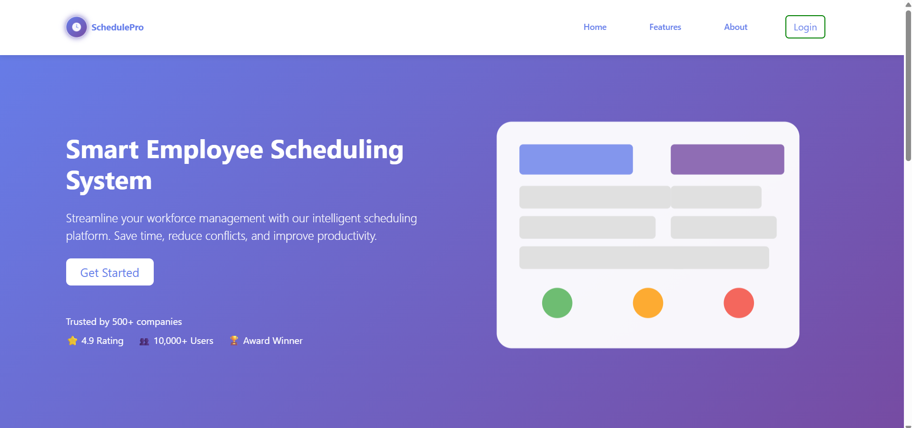 | 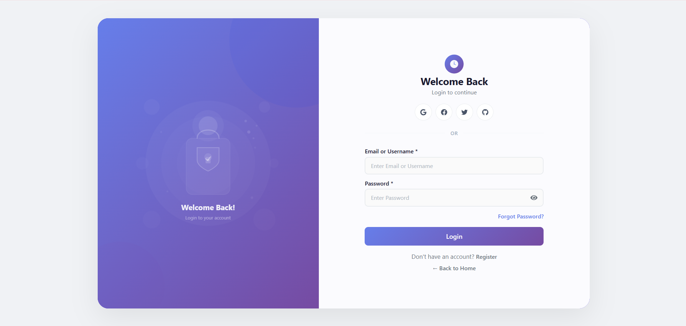 |

### 👤 Employee Dashboard

| Employee Dashboard | Employee Schedule |
|--------------------|-------------------|
| 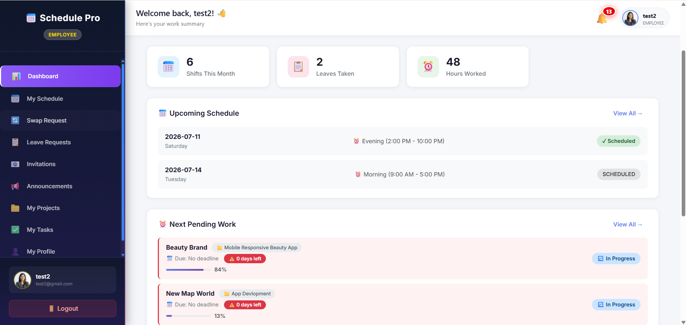 | 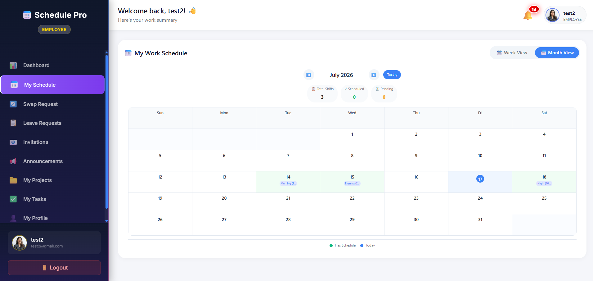 |

| Employee Leave | Employee Swap Request |
|----------------|----------------------|
| 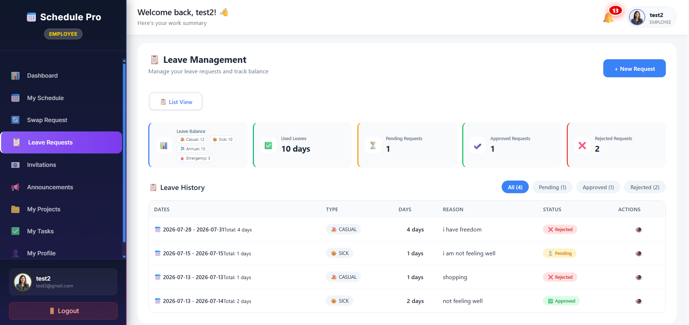 | 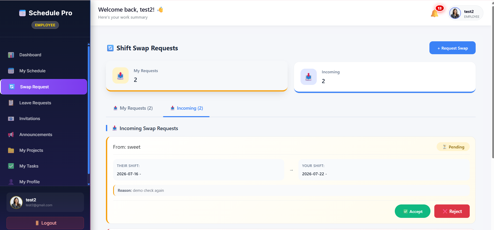 |

### 👔 Manager Dashboard

| Manager Dashboard | Manager Notification |
|-------------------|-----------------------|
| 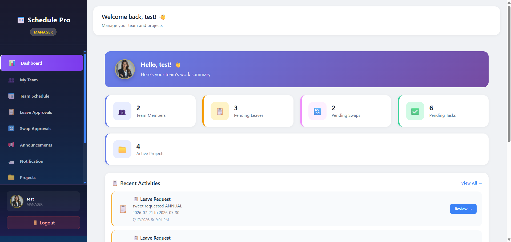 | 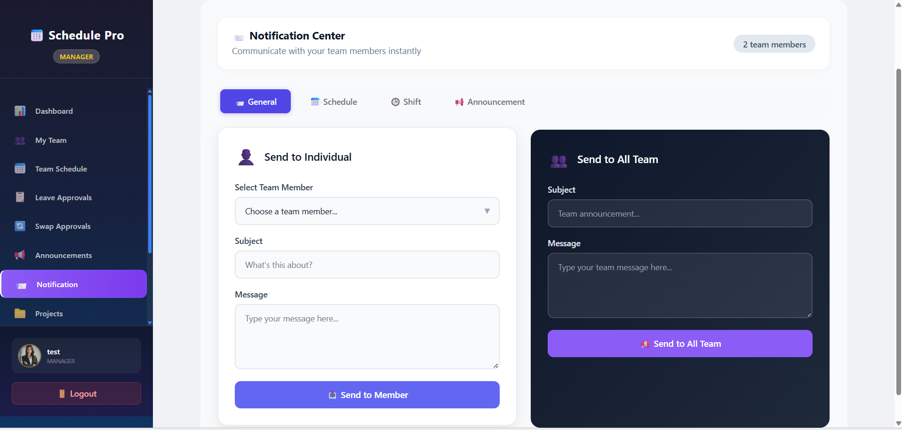 |

### 🔐 Admin Dashboard

| Admin Dashboard | Admin User Management |
|-----------------|----------------------|
| 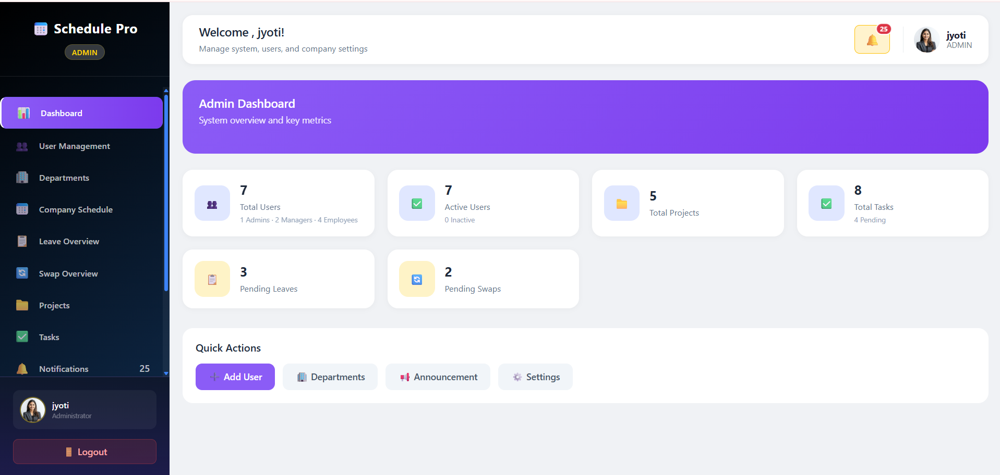 | 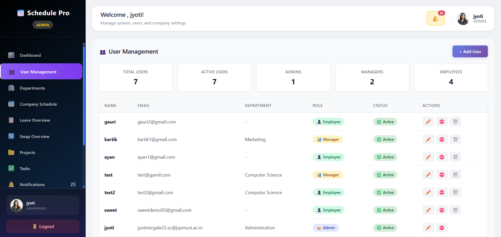 |

| Admin Projects | Admin Tasks |
|----------------|-------------|
| 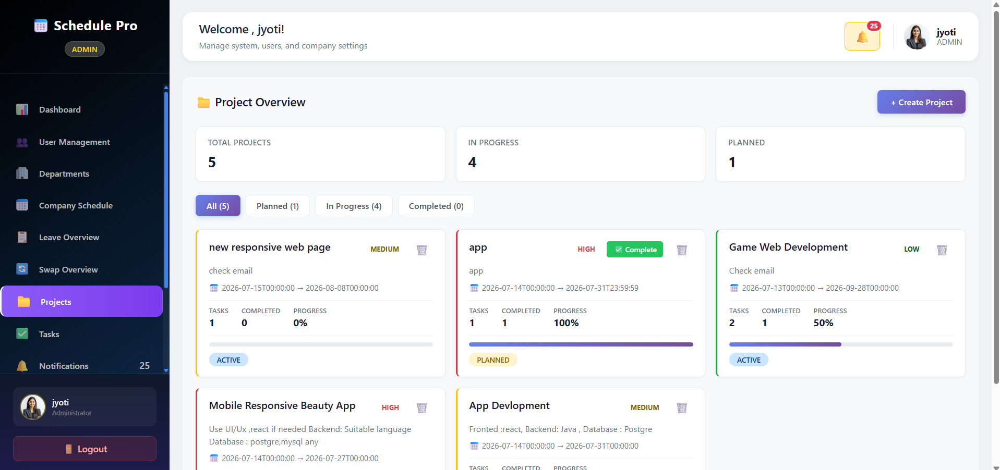 | 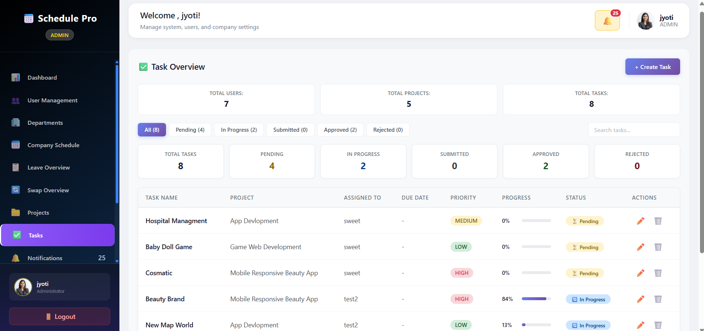 |

---

## 🚀 Future Enhancements

| Feature | Priority |
|---------|----------|
| Real-time WebSocket notifications | High |
| Email notifications with templates | High |
| Calendar integration | Medium |
| Mobile application | Medium |
| Advanced reporting with charts | Medium |
| AI-powered scheduling recommendations | Low |
| Multi-language support | Low |
| Dark mode | Low |
| Export reports to PDF/Excel | Medium |
| Integration with Slack/Teams | Low |

---

## Platform


| Platform |  Link                                                |
|----------|------------------------------------------------------|
| GitHub | [@Jyotimirgale25](https://github.com/Jyotimirgale25) |


---

**Built using Spring Boot, React, Docker, and Render**
